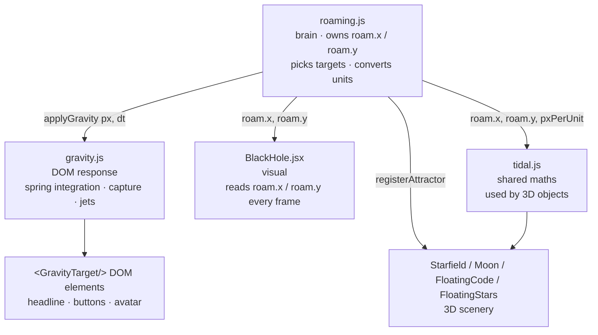
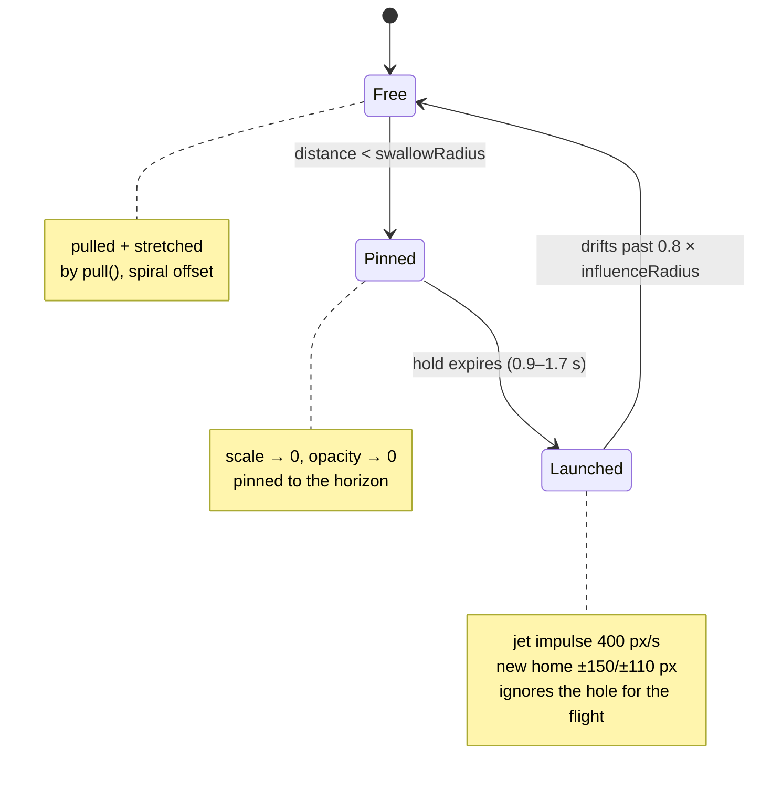

# Technical Architecture — medhatjachour.tech

**How this portfolio is built, and the weird, wonderful, physics-shaped parts of it.**

This document is the engineering companion to `README.md`. The README tells you *what* the site
does and how to deploy it. This one explains **how it works**, **why every non-obvious decision
was made**, and **where the creative bits live**, down to the constants.

Written for a developer who has to change something six months from now without breaking the
black hole.

---

## Table of contents

1. [The one-paragraph version](#1-the-one-paragraph-version)
2. [Stack and why](#2-stack-and-why)
3. [Architecture at a glance](#3-architecture-at-a-glance)
4. [The design system](#4-the-design-system)
5. [The hero: two universes](#5-the-hero-two-universes)
6. [The black hole: a ray-traced shader](#6-the-black-hole-a-ray-traced-shader)
7. [The roaming brain (`roaming.js`)](#7-the-roaming-brain-roamingjs)
8. [The DOM gravity simulation (`gravity.js`)](#8-the-dom-gravity-simulation-gravityjs)
9. [Shared tidal maths (`tidal.js`)](#9-shared-tidal-maths-tidaljs)
10. [The starfield: 3000 stars on the GPU](#10-the-starfield-3000-stars-on-the-gpu)
11. [`AdaptiveCanvas`: making 6 WebGL scenes affordable](#11-adaptivecanvas-making-6-webgl-scenes-affordable)
12. [Theming: night sky vs. day sky](#12-theming-night-sky-vs-day-sky)
13. [The rest of the site, section by section](#13-the-rest-of-the-site-section-by-section)
14. [The AI agent (and its offline fallback)](#14-the-ai-agent-and-its-offline-fallback)
15. [Build, bundling and performance](#15-build-bundling-and-performance)
16. [Deployment topology](#16-deployment-topology)
17. [Debugging field notes](#17-debugging-field-notes)
18. [Known issues](#18-known-issues)
19. [Tuning knobs](#19-tuning-knobs)
20. [Design decisions worth stealing](#20-design-decisions-worth-stealing)

---

## 1. The one-paragraph version

This is a **static React/Vite single-page site** whose hero contains a **ray-traced Schwarzschild
black hole** that drifts around the screen, **gravitationally lensing** the starfield behind it,
**pulling the actual DOM elements** of the page into its accretion disk, **spaghettifying** them as
they fall, and then **flinging them back out along its relativistic jets**. The 3D rendering and the
DOM manipulation are two completely separate systems that share exactly one piece of state: the
black hole's position. It runs at 60 fps on a laptop, it degrades to *nothing* on a phone, and it
turns itself off entirely for users who ask for reduced motion.

---

## 2. Stack and why

| Layer | Choice | Why this one |
| --- | --- | --- |
| Build | **Vite 4.5** | Instant HMR while iterating on shaders; `target: es2020` |
| UI | **React 18.3** | Concurrent-safe, huge ecosystem |
| 3D | **three 0.181 + @react-three/fiber 8.18** | Declarative WebGL — the scene graph *is* the component tree |
| 3D helpers | **@react-three/drei 9.122** | `Float`, `Text`, `MeshDistortMaterial`, `Text3D` — pure time savers |
| Animation | **framer-motion 12** | Springs and scroll-linked values without managing rAF by hand |
| State | **zustand 5** (+ `persist`) | Three tiny stores, no provider pyramid, no boilerplate |
| Styling | **Tailwind v4** + CSS custom properties | Utilities for layout, tokens for theme |
| Forms | **formik + yup** | Schema-validated contact form |
| Routing | **react-router-dom 7** | Present but minimal — one route today, room for more |

The unusual dependency is `three`, and it earns its 600 KB in the hero alone. Everything
3D-related is chunk-split so it never blocks first paint (see §15).

---

## 3. Architecture at a glance

```
main.jsx
└── App.jsx ──────────────── Router + theme bootstrapping
    ├── LoadingScreen        full-screen intro, typing effect
    ├── ScrollProgress       top bar + circular indicator
    ├── ThemeSwitcher        day / night toggle
    ├── MusicPlayer          looping ambient track
    ├── EasterEgg            "mga+" → full-screen 3D scene
    └── <Route path="/"> Home.jsx
        ├── HeroNew          ← the showpiece
        │   └── AdaptiveCanvas
        │       ├── Starfield        (night) 3000 instanced stars
        │       ├── FloatingStars    (night) 150 twinkling stars
        │       ├── FloatingCode     (night) 69 drei <Text> fragments
        │       ├── Constellations   (night) Big Dipper, Orion's Belt
        │       ├── Moon             (night) edible
        │       ├── BlackHole        (night) the shader
        │       ├── ShootingStar ×4  (night)
        │       └── Sun/Clouds/Birds (day)
        ├── SkillsJourney     DNA helix + skill particles + tech orbs
        ├── Experience        timeline + distort-material orbs
        ├── ProjectsShowcase  filter chips + tilt cards + live GitHub stats
        ├── Contact           formik/yup → Web3Forms
        ├── Footer
        └── AIAgent           floating 3D avatar + chat
```

### The three-layer hero

The hero is the only genuinely complex part of the codebase. It is deliberately split into three
layers that **do not import each other in a cycle**:



**The critical property:** `roaming.js` is stepped from a plain `requestAnimationFrame` loop that
lives in `HeroNew`, *not* from inside R3F's `useFrame`. That means the DOM-absorption effect keeps
running even when the WebGL canvas is paused, off-screen, or has failed to initialise. The visual
and the physics can fail independently; only the shared state connects them.

### The gravity state machine

Each DOM target and each 3D object moves through the same four phases real infalling matter does:



---

## 4. The design system

### Tokens as CSS custom properties

Theme values live in `src/index.css` as plain CSS variables on `:root` (day) and `.dark` (night),
not in JavaScript. Components read them via `var(--color-text)` etc. This means a theme switch is
**one class on `<html>`** and zero React re-renders of styled subtrees.

```css
:root            { --color-bg: #EEF2FB;  --color-text: #0F172A; --color-primary: #6366F1; }
.dark            { --color-bg: #0F172A;  --color-text: #F1F5F9; --color-primary: #818CF8; }
```

Both palettes also expose five gradients (`--gradient-primary`, `--gradient-hero`, …), which is how
the AI agent's header strip keeps matching the rest of the site without duplicating colour values.

`tailwind.config.js` mirrors the same indigo/purple/pink/emerald/amber/cyan family and sets
`darkMode: 'class'`, so `dark:` utilities and the CSS variables always agree.

### Atomic design

| Tier | Contains | Character |
| --- | --- | --- |
| `components/atoms/` | `Button`, `Input`, `Textarea`, `Magnetic`, `TiltCard`, `AdaptiveCanvas`, `Starfield`, `GravityTarget` | Primitives with no domain knowledge |
| `components/molecules/` | `AIAgent`, `MusicPlayer`, `GitHubStats`, `ThemeSwitcher`, `LoadingScreen`, `ScrollProgress`, `ProjectFilter`, `EasterEgg` | One clear job each |
| `components/organisms/` | `HeroNew`, `SkillsJourney`, `ProjectsShowcase`, `Experience`, `Contact`, `Footer`, `BlackHole` | Full page sections |

**The two atoms worth knowing about** are `AdaptiveCanvas` (§11) and `GravityTarget` (§8) — both
exist purely to make an ambitious effect safe to use.

---

## 5. The hero: two universes

`HeroNew.jsx` renders **two entirely different 3D scenes** depending on `useThemeStore().isDark`:

| Night (`isDark`) | Day |
| --- | --- |
| `Starfield` (3000 instanced quads) | `hemisphereLight` |
| `FloatingStars` (150 twinkling spheres) | `Sun` (4 nested emissive spheres, rotating glow) |
| `FloatingCode` (69 code fragments) | `Clouds` (25 puffs, 7 spheres each, drifting + wrapping) |
| `Constellations` (Big Dipper, Orion's Belt, one invented) | `Birds` (8 two-cone flapping groups) |
| `Moon` | — |
| **`BlackHole`** | — |
| `ShootingStar` ×4 (staggered 0/2500/5000/7500 ms) | — |

The black hole and its entire gravity simulation are **night-only** — the hero effect returns early
if `!isDark`. Day mode is a completely different, much calmer aesthetic. This isn't just theming:
it means the expensive path only runs when the user has opted into the dark theme.

**Camera:** `position: [0, 0, 10]`, `fov: 75`. A `ParallaxRig` inside the canvas lerps the camera
toward the pointer at 4.5 % per frame (`x` scaled ×1.3, `y` ×0.9) and re-`lookAt`s the origin — the
entire cosmos shifts with the mouse, including the black hole, with **zero layout cost**.

**Scroll-out:** framer-motion's `scrollYProgress` drives `opacity 1→0` and `scale 1→0.8` across the
first 30 % of the page, so the hero dissolves rather than being clipped.

---

## 6. The black hole: a ray-traced shader

`src/components/organisms/BlackHole.jsx`

This is **not** a sprite with a ring drawn on top. It is a single camera-facing quad whose fragment
shader **ray-traces null geodesics through curved spacetime**. Every visual feature falls out of the
maths; nothing is faked with a texture.

### 6.1 The render

```
<group.lookAt(camera)>          ← always square to the camera
  <mesh renderOrder={12}>       ← drawn last, depthTest/depthWrite false
    <planeGeometry 9 × 9>       ← world units, at z = -19
    <shaderMaterial  …>
```

The geometry is `BLACK_HOLE.size = 9` world units square, parked at `z = -19`. `group.position`
is set from `roam.x / roam.y` every frame; `group.lookAt(state.camera.position)` keeps the plane
billboarded so the shadow can never skew into an ellipse.

### 6.2 Integrating the light

Everything is in units where the Schwarzschild radius $r_s = 1$ (which implies $M = 0.5$).

For every pixel, a virtual observer at `CAM_DIST = 16`, `CAM_HEIGHT = 3.2` fires a photon whose
direction is the camera forward vector plus the pixel's UV offset scaled by `uZoom`:

$$
\vec{L} = \vec{r} \times \vec{v}, \qquad h^2 = |\vec{L}|^2
$$

The photon then marches along the **null-geodesic equation**:

$$
\frac{d^2\vec{r}}{d\lambda^2} = -\frac{3}{2}\,h^2\,\frac{\vec{r}}{r^5}
$$

integrated with **velocity-Verlet** (symplectic, so orbits don't spiral numerically) and an adaptive
step:

```glsl
float dt = clamp(0.075 * r, 0.035, 1.05);   // fine near the hole, coarse far away
```

Termination conditions:

- $r < 1$ → the photon crossed the horizon → `alpha = 1`, opaque black. **This is why the shadow
  genuinely occludes the starfield instead of just being a dark circle.**
- $r > \text{R\_ESCAPE} = 42$ → escaped to the background sky.
- step budget exhausted: `uSteps` = **150** normally, **92** on low-power devices, hard cap 200.

### 6.3 The accretion disk

Whenever the marching photon crosses the equatorial plane ($R_{IN} = 3 = \text{ISCO} <
\sqrt{x^2+z^2} < R_{OUT} = 10$), it samples a volumetric gas ring:

| Effect | Implementation |
| --- | --- |
| **Keplerian orbits** | $\Omega = \sqrt{0.5 / r^3}$ — differential rotation, so the disk shears |
| **Flaring profile** | scale height $H = 0.085r + 0.05$, vertical Gaussian $\exp(-y^2/2H^2)$ |
| **Turbulence** | 5-octave value-noise fBm (two layers, mixed 0.55) sampled in $(r - t \cdot 0.4,\; \varphi - \Omega t \cdot 10)$ — co-rotating, so it *shears into spiral arms* rather than sliding |
| **Doppler beaming** | $\beta = \min(0.92, \sqrt{0.5/(r-1)})$, $\gamma = 1/\sqrt{1-\beta^2}$, $\delta = 1/(\gamma(1 - \beta\,\hat{v}\cdot\hat{o}))$, brightness $\propto \delta^3$ |
| **Gravitational redshift** | $g_z = \sqrt{1 - 1/r}$ — dims *and* reddens gas near the horizon |
| **Emissivity falloff** | $\propto (R_{IN}/r)^2$ |
| **Colour** | A 4-stop blackbody-ish ramp (white-hot → gold → orange → ember), shifted hotter on the approaching side: `tShift = t + 0.35(1-δ) - 0.15(1-g_z)` |

The result is a disk where the approaching limb **blazes** and the receding limb dims — the
asymmetry that makes every real black hole image look fake. It is the single most convincing detail
in the whole scene, and it is three lines of code.

### 6.4 The photon ring, the halo and the tone map

Once the march finishes, two analytic Gaussians are added in screen space:

```glsl
float shadowR = (2.6 / CAM_DIST) / uZoom;                       // ≈ 2.6 r_s angular radius
float ring    = exp(-pow((rho - shadowR) / (shadowR * 0.17), 2.0));
col += vec3(1.0, 0.88, 0.68) * ring * 0.55 * uBrightness;       // photon ring
float halo    = exp(-pow((rho - shadowR) / (shadowR * 1.15), 2.0)) * 0.15;
col += vec3(1.0, 0.68, 0.42) * halo * uBrightness;              // warm spill
```

> The photon ring is analytic rather than marched. Real photon-ring light has orbited the hole
> dozens of times; marching that would need thousands of steps for a sub-pixel payoff. A Gaussian
> hugging the shadow reads identically and costs nothing.

Then a **filmic tone map** `col = 1 - exp(-col)` — this is what keeps the inner disk blazing white
without clipping the whole accretion flow into a flat blob.

Finally an **edge fade**, `smoothstep(1.0, 0.74, rho)`, applied to both colour and alpha. Without it
a hard rectangular seam appears at the quad border. With it, the billboard is invisible.

### 6.5 Premultiplied compositing

The material uses custom blending rather than anything three.js offers out of the box:

```js
blending: THREE.CustomBlending,
blendSrc: THREE.OneFactor,
blendDst: THREE.OneMinusSrcAlphaFactor,
```

$$
\text{result} = \text{col} + \text{dst}\cdot(1 - \alpha)
$$

This single line lets **glowing gas add to the sky behind it** (because `col` is added directly)
while the **shadow stays perfectly opaque** (because where `col = 0` and `alpha = 1`, the destination
is fully replaced). Standard alpha blending can do one or the other; never both.

`depthTest`/`depthWrite` are both `false` and `renderOrder = 12`, so the hole composites over the
starfield regardless of what the depth buffer thinks.

### 6.6 The relativistic jets

Four additive sprites, stretched into beams and animated with a sinusoidal "breathing" so they read
as flowing plasma:

| Beam | Scale | Colour | Opacity | Speed |
| --- | --- | --- | --- | --- |
| Outer ± | 1.7 × 10.5 | `#5fb0ff` | 0.22 | 2.6 / 3.1 |
| Core ± | 0.5 × 9.0 | `#eaf6ff` | 0.40 | 3.6 / 4.1 |

```js
beam.material.opacity = (cfg.opacity + 0.09 * Math.sin(phase)) * brightness;
beam.scale.set(cfg.sx, cfg.sy * (1 + 0.05 * Math.sin(phase * 0.6)), 1);
```

> **Gotcha discovered the hard way:** `renderOrder` does **not** propagate from a parent `<group>`.
> It must be set on each sprite individually (`renderOrder={11}`) so the beams' bases stay *behind*
> the shadow (`renderOrder={12}`). Setting it on the group silently does nothing.

### 6.7 Performance

`isLowPowerDevice()` reduces the step count from 150 → 92 when `innerWidth < 1280` **or**
`navigator.hardwareConcurrency <= 4`. The shader is the most expensive thing on the page by a wide
margin; the step budget is the throttle.

---

## 7. The roaming brain (`roaming.js`)

`src/utils/roaming.js` is the **single source of truth** for where the black hole is. It exists as
plain module state — not React state, not a store — because it is read at 60 fps by two consumers
that must never disagree.

```js
export const roam = { x: 0, y: 1.5, tx: 0, ty: 1.5, timer: 0 };
```

### 7.1 World ↔ pixel conversion

The hole lives in world units on a plane at `z = -19`; the DOM lives in pixels. The bridge is one
function:

```js
export function pxPerUnit(height) {
  const dist = CAMERA_Z - BLACK_HOLE.planeZ;                        // 10 - (-19) = 29
  return height / (2 * dist * Math.tan((FOV_DEG * Math.PI) / 360)); // fov 75
}
```

At 1440 × 900 that is ≈ **20.2 px per world unit**. So:

| Quantity | World | Pixels (1440×900) |
| --- | --- | --- |
| Billboard plane | 9 | ≈ 182 px |
| Shadow radius | 0.975 | ≈ 20 px (≈ 40 px across) |
| Gravity influence | — | `max(110, shadowR × 8)` ≈ **158 px** |

### 7.2 Target selection — the hole actually hunts

Every 2.4–6 seconds the hole picks a new destination with a weighted roll:

```js
if (domCenters.length && roll < 0.5)        // 50 % → hunt a DOM element
else if (skyTargets.length && roll < 0.8)   // 30 % → hunt the moon / a code word
else                                        // 20 % → wander to empty sky
```

DOM centres are screen-space, so they're converted back to world units before use. This is the
difference between "an animation plays" and "the thing is *hunting my buttons*" — and it's about
eight lines of code.

### 7.3 The attractor registry

3D objects can't be measured like DOM elements can, so they register a callback instead:

```js
registerAttractor(() => ({ x: MOON_POSITION[0], y: MOON_POSITION[1] }))
```

Two things make this elegant:

1. **It returns an unsubscribe function**, matching the `useEffect` cleanup contract exactly.
2. **It may return `null`.** The Moon returns `null` while it is swallowed — so the hole genuinely
   *stops chasing a moon that isn't there*, and starts again when a new one fades in. Behaviour
   emerges from a null check.

`FloatingCode` registers every 7th fragment (10 of 69) the same way.

### 7.4 Stepping

```js
roam.x += (roam.tx - roam.x) * Math.min(1, dt * 0.8);   // frame-rate independent glide
```

Every 2 seconds it calls `invalidateMeasurements()` so that **reflows, font swaps and window
resizes** can't leave the physics mapped to stale coordinates.

Then it converts world → screen and hands off:

```js
applyGravity(width/2 + roam.x * scale, height/2 - roam.y * scale,
             Math.max(110, shadowRadiusPx * 8), root, dt);
```

### 7.5 Why a plain rAF loop in `HeroNew`

```js
const tick = (now) => {
  const rect = section.getBoundingClientRect();
  if (rect.bottom > 0 && rect.top < window.innerHeight) stepRoam(dt, section);
  raf = requestAnimationFrame(tick);
};
```

- **Decoupled from WebGL.** Canvas paused, throttled, crashed, or never created? The UI still gets
  bent. The effect degrades visually, not functionally.
- **Scoped to visibility.** The simulation only steps while the hero is on screen.
- **Fails safe on resize.** `watchMobileViewport` stops the loop and calls
  `resetGravityTargets()` the moment the viewport becomes phone-sized — handing every element back
  untouched.

---

## 8. The DOM gravity simulation (`gravity.js`)

`src/utils/gravity.js` is where the page's own **DOM elements get pulled into a black hole**. This
is the creative centrepiece: it isn't a canvas effect layered *over* the UI, it's the UI itself
being deformed.

### 8.1 Opting in with `<GravityTarget/>`

```jsx
<GravityTarget className="flex justify-center mb-6">
  <motion.div …>
    
  </motion.div>
</GravityTarget>
```

Why a wrapper rather than animating the element directly:

- The wrapper owns `transform` and `opacity`; **framer-motion keeps owning the child's** animations.
  No fighting over the same style property.
- `transformOrigin: center center` and `willChange: 'transform, opacity'` are set once.
- It renders a plain `<div>`, so it's a drop-in replacement — just move the layout classes onto it.

### 8.2 Measuring without triggering layout thrash

```js
function layoutOffset(el, root) {
  let x = 0, y = 0, node = el;
  while (node && node !== root) {
    x += node.offsetLeft || 0;
    y += node.offsetTop  || 0;
    node = node.offsetParent;
  }
  return { x, y };
}
```

Walking the `offsetParent` chain reads `offsetLeft`/`offsetTop`, which **ignore transforms**. That's
the trick that lets the code measure an element *while animating it* without the measurement
feeding back into the animation. The alternative (`getBoundingClientRect`) would return the
transformed box and the simulation would chase its own tail.

Measurements are cached and only invalidated on resize or on the 2-second refresh from §7.4.

### 8.3 A damped spring, not a lerp

```js
const SPRING  = 34;   // 1/s²
const DAMPING = 9;    // 1/s
// ζ = 9 / (2√34) ≈ 0.77  →  slightly underdamped

const accX = (targetX - t.x) * SPRING - t.vx * DAMPING;
t.vx += accX * step;
t.x  += t.vx * step;
```

This is the single best "feel" decision in the file.

- A plain `lerp` has **no momentum** — an element slides into place limply.
- A spring **overshoots and settles**, so a jet launch reads as a physical throw with an arc.
- `ζ ≈ 0.77` is deliberately a touch underdamped: energetic, but it always comes to rest.
- `SPRING` is deliberately *soft*. A stiff spring yanks elements in within two frames, which reads
  as a **snap**, not a **fall**. A fall needs time to accelerate.

Scale and opacity have no momentum to model, so they use a frame-rate-independent exponential ease
instead:

```js
const ease = 1 - Math.exp(-EASE_PER_SECOND * step);   // EASE_PER_SECOND = 10
```

`step = min(dt, 0.05)` everywhere, so a stalled tab can never explode the integrator.

### 8.4 Distance is measured from where the element *is*

```js
const toHoleX = bhX - (cx + t.x);   // current position, not home
```

This one line was the fix for a genuinely confusing bug. Measuring from the element's **home**
position meant that as an element fell inwards, the measurement *lagged behind it* — so captures
only ever fired if the hole happened to pass over the original spot, and elements would hover a few
pixels short of the horizon forever. Measuring from the current position makes the fall actually
complete.

### 8.5 Spaghettification

Real tidal forces stretch infalling matter along the radius and squeeze it across. The DOM version:

```js
const bell    = pull * (1 - pull) * 4;         // peaks at half distance, 0 at both ends
const stretch = MAX_STRETCH * bell * pull;     // 3.4, weighted by proximity

const alongRadius  = size * (1 + stretch);
const acrossRadius = size * Math.max(1 - stretch * CROSS_SQUEEZE, CROSS_FLOOR);
```

Then the transform — this is the neat part:

```js
el.style.transform =
  `translate3d(${x}px, ${y}px, 0) ` +
  `rotate(${deg}deg) ` +
  `scale(${alongRadius}, ${acrossRadius}) ` +   // long axis, thin axis
  `rotate(${-deg}deg)`;                          // rotate the squeeze back
```

**Rotate → scale → un-rotate** is how you stretch an element along an *arbitrary* axis using only a
2D scale. Without the outer `rotate(-deg)` the element would also be sheared into a parallelogram.

Two constants make it safe:

- `CROSS_SQUEEZE = 0.72` — how thin the cross axis gets at peak stretch.
- `CROSS_FLOOR = 0.3` — **mandatory.** Without a floor, the cross-axis multiplier crosses zero,
  goes negative, and the element **mirrors inside out** mid-fall. It looks like a rendering bug, and
  it is entirely a maths bug.

The bell curve is weighted twice by `pull` (`bell * pull`) so that an element merely *resting* inside
the influence radius isn't permanently deformed — only one actually falling gets noodled.

### 8.6 Angular momentum and the spiral

```js
const spiral = SPIRAL_PX * pull * (1 - pull);        // 160 px
targetX = homeX + (bhX - cx - homeX) * pull * 0.98 - radialY * spiral;
targetY = homeY + (bhY - cy - homeY) * pull * 0.98 + radialX * spiral;
```

`(-radialY, +radialX)` is the **perpendicular** to the radius, so the peak of the spiral bends the
path sideways. Physically: infalling matter must shed angular momentum before it can fall in, so its
path curves rather than dropping straight down the radius. Visually: the element *orbits in* instead
of being dragged in a straight line.

### 8.7 Capture and the jet launch

```js
if (dist < swallowRadius) {              // swallowRadius = influenceRadius * 0.3
  t.swallowed = true;
  t.hold = 0.9 + Math.random() * 0.8;    // pinned for a beat — you can SEE it cross
  t.vx = t.vy = 0;
}
```

| Phase | Behaviour |
| --- | --- |
| **Captured** | `targetX/Y` = the horizon, `scale → 0`, `opacity → 0` — set *explicitly*, not derived from `pull`. (Deriving it meant elements captured at the edge of the swallow radius only half-vanished.) |
| **Released** | The jet throws it: axis `±90° ± 55°`, distance 90–230 px, scattered over `±150 / ±110 px` of new home, plus an **impulse of 400 px/s**. It gets a new home *and* a kick, so it's *thrown*, not teleported. |
| **Cooldown** | 4–7 s during which the hole ignores it entirely (`getTargetCenters` skips it). |

While a released element is flying, `effectivePull = 0` — **the jet is not fighting the pull of the
very hole that just threw it.** Once it drifts past `0.8 × influenceRadius`, it's free again.

### 8.8 Self-healing

```js
t.homeX *= HOME_DECAY;   // 0.9988  →  ~10 s half-life
t.homeY *= HOME_DECAY;
```

Every displaced element's home **decays back toward zero**, so a jet launch is clearly visible and
then the hero quietly reassembles itself. A portfolio that permanently scrambles its own headline
after 30 seconds is a bug; one that recovers is a *trick*.

### 8.9 Zero-cost by construction

```js
el.style.transform = …;
el.style.opacity   = …;
```

- **No React state per frame** → zero re-renders.
- **`transform` and `opacity` never affect layout** → the page never reflows, never shifts, never
  thrashes. This is why the effect can be this aggressive and still feel smooth.
- `.toFixed()` on every number keeps the strings stable and avoids layout engine churn from
  scientific notation.

### 8.10 The escape hatches

```js
if (prefersReducedMotion || !root) return;
```

Plus `resetGravityTargets()`, which zeroes every target and clears `style.transform` /
`style.opacity` — called on mobile resize, on unmount, and when `prefers-reduced-motion` is set.
**Nothing is ever left bent around an invisible black hole.**

---

## 9. Shared tidal maths (`tidal.js`)

`src/utils/tidal.js` gives 3D objects the same physics the DOM gets, from one shared function. Every
consumer calls `tidalAt(x, y, z)` and receives `{ dist, lateral, pull, capture, angle, stretch, tear,
longAxis, shortAxis }`.

### 9.1 Why *lateral* distance, not 3D distance

```js
const lateral = Math.hypot(dx, dy);   // screen-plane
const dist    = Math.sqrt(dx*dx + dy*dy + dz*dz);   // true 3D

const raw  = 1 - lateral / REACH;
const pull = raw * raw * (3 - 2 * raw);            // smoothstep
```

The hero camera looks straight down −Z, so **the lateral offset is what the eye reads as "how close
is that thing to the hole"**. Using the true 3D distance would make an object at `z = -30` behave
completely differently from a DOM element at the same screen position — the 3D scene and the DOM
would visibly disagree. `dist` is still returned for anything (like the starfield) that genuinely
needs the real separation.

### 9.2 The output

| Field | Meaning |
| --- | --- |
| `pull` | 0 outside `REACH = 13`, 1 sitting on the horizon (smoothstep) |
| `capture` | `1 - clamp01((lateral - 2) / 3.5)` → 1 fully swallowed |
| `angle` | `atan2(dy, dx)` — screen-space radius angle, ready for `rotation.z` |
| `stretch` | `MAX_STRETCH 3.2 · bell · pull` — peaks halfway in |
| `tear` | `max(0, 6 - lateral) · 0.85` — the extra spike as it plunges |
| `longAxis` | `1 + stretch + tear` ✔ pre-clamped |
| `shortAxis` | `max(1 - elongation·0.5, CROSS_FLOOR 0.22)` ✔ pre-clamped |

> **Consumers must use `longAxis`/`shortAxis`, never the raw `stretch`.** Raw stretch exceeds 1 near
> the horizon, and applying it directly **inverts the object's scale**. The clamping lives here, once,
> so no consumer can get it wrong.

### 9.3 Consumers

| Object | Uses |
| --- | --- |
| `Moon` | pull → drift, `rotation.z = angle`, `scale(long, short, 0.45 + short·0.55)`; remembers being eaten via `lifeRef` and respawns after 7–16 s |
| `FloatingCode` | pull → drift + rotate the text, `scale(survive·long, survive·short, survive)` |
| `FloatingStars` | pull → drift, stretch, `opacity × (1 - pull)` |
| `Starfield` | mirrored in GLSL (§10) |

The Moon's death and rebirth is the nicest emergent detail: it has a `lifeRef = { alive, respawnAt }`,
disappears at `capture > 0.97`, and a **brand-new** moon fades in later. Nothing ever comes back out
of a horizon.

---

## 10. The starfield: 3000 stars on the GPU

`src/components/atoms/Starfield.jsx`

3000 stars, **one draw call**, and all the black-hole interaction computed in the vertex shader.
Nothing is written back to the CPU per frame except the hole's position.

### 10.1 Instancing

`InstancedBufferGeometry` wrapping a unit `PlaneGeometry(1,1)`, with three instanced attributes:

| Attribute | Purpose |
| --- | --- |
| `iOffset` | the star's world position |
| `iScale` | its size (0.22 – 0.52) |
| `iColor` | its tint |

The quads are built **in the camera plane** using the view matrix's right/up vectors, so each star
always faces the camera — and, more importantly, its **streak can be oriented along the screen-space
radius** toward the hole.

### 10.2 The four effects, in GLSL

```glsl
// Depth-scaled so a near star and a far star at the same SCREEN distance behave the same.
float depth   = max(cameraPosition.z - iOffset.z, 1.0)
              / max(cameraPosition.z - uBH.z, 1.0);
float pull    = 1.0 - smoothstep(capture * depth, reach * depth, b);

// 1. Gravitational light bending — stars pile up into an Einstein ring
base.xy -= radial * (2.4 / max(b, 0.9)) * depth;

// 2. Accretion — drawn inward, then swirled sideways (angular momentum loss)
base.xy += radial * (pull * b * 0.9);
base.xy += vec2(-radial.y, radial.x) * (pull * pull * 2.6 * depth);

// 3. Spaghettification — long radially, thin across
float stretch = pull * (1.0 - pull) * 4.0 * pull * 8.0;
```

The quad is then assembled along the screen radius:

```glsl
vec2 offs = rAxis * (local.x * (1.0 + stretch))
          + tAxis * (local.y * max(1.0 - stretch * 0.19, 0.16));
```

Note `max(…, 0.16)` — **the same cross-axis floor as `gravity.js`.** Same bug, same reason.

**4. Capture.** `vAlpha = 1.0 - smoothstep(0.55, 1.0, pull)` — anything crossing the horizon fades
out completely.

Two finishing touches that sell it:

```glsl
float streakBoost = 1.0 + stretch * 0.45;   // long streaks would otherwise fade to nothing
float ring = exp(-pow((b - capture * 2.2) / (capture * 1.4), 2.0));
vColor = iColor * twinkle * streakBoost * (1.0 + 2.6 * ring);   // flare where stars crowd
```

The fragment shader samples a runtime-generated radial-gradient glow texture and `discard`s anything
with `alpha <= 0.004`.

### 10.3 Seeded randomness, deliberately

Everywhere in this codebase — `Starfield`, `FloatingStars`, `FloatingCode`, `Clouds`, `Birds`,
`HeroNew`'s particles — randomness comes from a **deterministic hash**, not `Math.random()`:

```js
const pseudoRandom = (seed) => {
  const x = Math.sin(seed * 12.9898 + 78.233) * 43758.5453;
  return x - Math.floor(x);
};
```

Consequences: the layout is **identical on every reload** (so the hole's attractor targets are
stable), React StrictMode double-invokes are harmless, and there are no `useMemo`-with-Math.random
purity warnings. It also makes the scene *debuggable* — a specific seed always produces a specific
bug.

### 10.4 Shaders exported for testing

```js
export const starfieldVertexShader   = /* glsl */`…`;
export const starfieldFragmentShader = /* glsl */`…`;
```

Named exports exist so the GLSL can be imported and **compile-tested in isolation**, without
mounting a canvas. A shader syntax error would otherwise only surface as a blank canvas.

---

## 11. `AdaptiveCanvas`: making 6 WebGL scenes affordable

`src/components/atoms/AdaptiveCanvas.jsx` is a drop-in `<Canvas>` replacement, and it is the reason
this site can afford three decorative 3D backgrounds plus a 3D avatar plus a full-screen easter egg.

| # | Optimisation | Implementation |
| --- | --- | --- |
| 1 | **Lazy context creation** | An `IntersectionObserver` on an absolutely-positioned sentinel (`rootMargin: 200px`) only mounts the R3F `<Canvas>` when it approaches the viewport |
| 2 | **Off-screen pause** | A second observer sets `frameloop = inView ? frameloop : 'never'` — idle scenes stop consuming GPU/CPU and resume seamlessly |
| 3 | **Capped DPR** | `dpr = [1, 1.5]` instead of native retina — decorative backgrounds at 3× fill rate is pure waste |
| 4 | **Mobile fallback** | Returns `null` on `≤ 767px` unless `keepOnMobile` is passed |

The `keepOnMobile` flag distinguishes **decoration** from **content**: the AI agent's avatar and the
easter-egg scene are the content of their containers, so they stay. Decorative hero/section
backgrounds vanish and the parent's CSS gradient shows through.

While unmounted-for-laziness it renders `<div style={{position:'absolute', inset:0}} />` — an
out-of-flow sentinel with **zero layout impact**, matching the absolutely-positioned containers these
canvases already live in.

### The shared viewport contract

`src/utils/viewport.js` exports `MOBILE_QUERY = '(max-width: 767px)'`, `isMobileViewport()` and
`watchMobileViewport(cb)`.

> Two systems depend on this and they **must agree**: `AdaptiveCanvas` skips the 3D scene on phones,
> and the hero's gravity sim must stop. If they disagreed you'd get the worst possible outcome — **the
> UI being pulled around by a black hole that isn't being drawn.** One exported constant makes that
> impossible by construction.

---

## 12. Theming: night sky vs. day sky

| Concern | Where |
| --- | --- |
| State | `themeStore.js` — zustand + `persist`, key `theme-storage` |
| DOM sync | `App.jsx` toggles `.dark` on `<html>` in an effect |
| First visit | `App.jsx` reads `prefers-color-scheme` **only if** no stored preference exists |
| Narrative | `ThemeSwitcher` frames it as "from learning (light) to mastery (dark)" |
| Hero | swaps the entire 3D universe, and gates the black hole + gravity on `isDark` |

Because tokens are CSS variables, the theme switch is one class toggle; because the hero reads
`isDark` from the store, the 3D universe swaps with it. **There is no third place where theme state
lives.**

---

## 13. The rest of the site, section by section

### `SkillsJourney`
- **`DNAHelix`** — 100 small emissive spheres on a double helix (2 full turns over 8 units), colour
  banded by quarter, rotating at 0.2 rad/s. Growth and evolution, as a shape.
- **`SkillParticles`** — 50 points per skill, arranged in a ring per skill, gently bobbing.
- **`TechOrb`** — `Float` + `MeshDistortMaterial` spheres. Deliberately **no rigid boxes**: the
  section is about organic growth.
- Content reveals use framer-motion's `useInView`.

### `ProjectsShowcase`
- `ProjectFilter` — tech chips driven by a single `activeFilter` string.
- `TiltCard` — cursor-driven `rotateX/rotateY` via motion values + springs
  (`stiffness 150, damping 14, mass 0.4`), `max 9°`, `transformPerspective: 900`. Springs back on
  leave. Uses `transform` only — no layout impact.
- `GitHubStats` — hits the public GitHub REST API (`/users/…` and `/users/…/repos?per_page=100`),
  sums stars and forks client-side, **no auth token**. Renders an animated skeleton while loading
  and degrades quietly on error.
- `ProjectOrbs` / `FloatingStarsAndCircles` — background depth.

### `Experience`
A timeline of real work history, decorated with `ExperienceOrb`s — dodecahedrons with
`MeshDistortMaterial` (metalness 0.8, roughness 0.2, opacity 0.6).

### `Contact`
- **formik + yup** for validation, `formStore` for `isSubmitting / submitSuccess / submitError`.
- Submits to **Web3Forms** — a free no-backend form relay — with the access key from
  `import.meta.env.VITE_WEB3FORMS_KEY` (falling back to a hard-coded key).
- Success and error banners auto-clear after 5 s.

### `MusicPlayer`
`/interstellar.mp3`, `loop`, default volume 0.3. Notable detail: **playback state is synced from the
audio element's own events** (`play` / `pause` / `ended`) rather than set optimistically on click.
The button can therefore never disagree with what's actually playing.

### `LoadingScreen`
A 40 ms-per-character typing effect for the tagline. The clever bit:

```js
return Math.min(prev + 6 + Math.random() * 14, typingComplete ? 100 : 92);
```

Progress **fills fast but holds at 92 %** until the tagline has finished typing. The loader can
never complete before the message is readable — so the intro feels deliberate instead of arbitrary.
Then 100 % → 450 ms fade.

### `ScrollProgress`
framer-motion `useScroll` + `useSpring({ stiffness: 100, damping: 30, restDelta: 0.001 })` driving
both a top gradient bar (`scaleX`) and a circular SVG indicator, plus a numeric percentage.

### `EasterEgg`
Type **`mga+`** anywhere → a full-screen 3D scene (500 particles, a distorted icosahedron, floating
orbs) for 5 s. A konami code for the initials.

### `Magnetic`
Wraps hero CTAs so they pull toward the cursor (`strength 0.35`) with springs, and spring back on
leave. Wraps the `<a>` inside a `GravityTarget`, so the two effects **compose without conflicting** —
`Magnetic` owns the motion values, `GravityTarget` owns the transform on its own wrapper div.

> `Magnetic` and `TiltCard` are inherently inert on touch devices, because `mousemove` never fires.
> No media query needed.

---

## 14. The AI agent (and its offline fallback)

`src/components/molecules/AIAgent.jsx` + `src/data/agentPersonality.js` + `src/store/agentStore.js`

### The 3D avatar reacts to conversation state

A distorted sphere + additive inner glow + wireframe cage + three orbital rings + 200 dust particles.
Every motion parameter is driven by the store's `isThinking` / `isTalking`:

| State | Rotation | `distort` | Ring pulse | Dust opacity |
| --- | --- | --- | --- | --- |
| Idle | 0.4 | 0.16 ± 0.04 | slow | 0.38 |
| Thinking | 2.6 | 0.32 ± 0.10 | 5 Hz | 0.55 + flicker |
| Talking | 1.5 | 0.42 ± 0.16 (8 Hz) | — | — |

The orb **visibly thinks faster** when it's thinking. The scene is a `keepOnMobile` canvas — the
avatar *is* the content of that panel.

### Two brains, one interface

```js
const apiKey = import.meta.env.VITE_GEMINI_API_KEY;
if (apiKey) { /* Gemini 2.0 Flash generateContent */ }
// otherwise: a short artificial delay, then getLocalReply()
```

| Path | Behaviour |
| --- | --- |
| **Gemini** | `gemini-2.0-flash:generateContent` with `system_instruction = MEDHAT_SYSTEM_PROMPT`, prior turns mapped `user`/`model`, `maxOutputTokens: 350`, `temperature: 0.85` |
| **Local** | A ~20-rule regex engine (`getLocalReply`) covering greetings, role, experience, skills, projects, hiring, contact, location, education, this-site, hobbies, "who are you", "best project" |
| **Timing** | Fallback replies are delayed 550–1050 ms — a reply that appears instantly reads as fake |
| **Typing** | `deliver()` sets `isTalking` for `min(len × 45 ms, 5 s)`, so longer answers animate longer |

> **The agent can never fail.** `getLocalReply`'s final `return` is a generic-but-useful message, so
> *every* input produces *some* answer. The API is an enhancement layered on a system that always
> works — which is also why `VITE_GEMINI_API_KEY` being missing is a silent degradation, not an error.

The system prompt (`MEDHAT_SYSTEM_PROMPT`) is a first-person persona document with sections for
about, contact, experience, skills and projects. It lives in `src/data/`, not inline in the
component, so it can be edited freely without touching logic.

---

## 15. Build, bundling and performance

```js
// vite.config.js
build: {
  target: 'es2020',
  cssCodeSplit: true,
  rollupOptions: {
    output: {
      manualChunks: {
        three:  ['three'],
        r3f:    ['@react-three/fiber', '@react-three/drei'],
        framer: ['framer-motion'],
        vendor: ['react', 'react-dom', 'react-router-dom', 'zustand'],
      },
    },
  },
  chunkSizeWarningLimit: 1200,
}
```

Splitting `three` and R3F into their own chunks means the heavy 3D payload **downloads in parallel
with React, is cached independently, and never blocks first paint** of the above-the-fold text.

### The performance budget, summarised

| Technique | Where | Saves |
| --- | --- | --- |
| Instanced quads, 1 draw call for 3000 stars | `Starfield` | 2999 draw calls |
| All physics in the vertex shader | `Starfield` | 3000 × per-frame CPU updates |
| `dpr` capped at 1.5 | `AdaptiveCanvas` | ~4× fill rate on retina |
| `frameloop="never"` off-screen | `AdaptiveCanvas` | 100 % of idle GPU |
| Lazy WebGL contexts | `AdaptiveCanvas` | Several simultaneous contexts on load |
| `null` on ≤767 px | `AdaptiveCanvas` | All 3D on phones |
| `transform`/`opacity` only, no React state | `gravity.js` | Every re-render and every reflow |
| Seeded PRNG instead of `Math.random` | everywhere | Purity warnings + unstable props |
| Reduction of shader steps on weak devices | `BlackHole` | The single most expensive pass |

**Zero React re-renders happen during the hero animation.** The entire effect is inline styles on
DOM nodes written from a `Set` of plain objects.

---

## 16. Deployment topology

### Production: static files behind a shared proxy

The live site is **not its own container**. It is a directory of static files bind-mounted
read-only into a shared reverse proxy:

| Host | Serves | Backed by |
| --- | --- | --- |
| `medhatjachour.tech`, `www.` | **this portfolio** | nginx static from `portfolio-dist` |
| `www.bizflow.…` | BizFlow | `bizflow-app:3000` |
| `www.bizflow.…/demo/` | BizFlow web UI | `bizflow-app:5180` |
| `www.transhub.…` | TransHub | `transhub-web:80` |
| `api.transhub.…` | TransHub API | `transhub-api:4000` |

The proxy config, TLS certs and the compose file that runs the *other* sites all live in the
**BizFlow repo** (`docs/PRODUCTION_SERVER_RUNBOOK.md` §15 is authoritative).

> **`Dockerfile`, `docker-compose.yml` and `nginx.conf` in this repo are inert in production.**
> They exist only as the standalone/self-hosting option, now bound to `127.0.0.1:8080` on purpose so
> a proxy must sit in front.

Consequences of the static-directory design: a deploy **cannot** rebuild or restart BizFlow or
TransHub, cannot touch the proxy config, TLS or DNS, and needs no `docker compose up` unless the
directory doesn't exist yet.

### `deploy-vps.sh`

```
preflight (tar, ssh, scp, curl, npm) + assert .env has both VITE_ keys
  → npm run build
  → tar -czf portfolio-dist.tar.gz -C dist .
  → scp to /tmp
  → extract into /home/medhat/bizflow/portfolio-dist
      via a throwaway root alpine container (+ chown -R 1000:1000)
  → smoke test
```

The extraction step is not obvious and is the reason this is a script: Docker created that host
directory as `root:root` and `medhat` has no passwordless `sudo`, so files have to be unpacked
through a temporary root container. The bind mount is live, so no restart is needed.

`git push` does **not** deploy. There is no `.github/workflows` in this repo, and the runbook
deliberately excludes it from BizFlow's workflow. Pushing and deploying are two separate steps.

### The favicon cache trap

Two decisions here are worth preserving:

1. **`index.html` declares only the SVG.** `favicon.ico` is deliberately *not* declared — browsers
   that can't render SVG request it on their own, and it sits in `public/` as the automatic
   fallback. Declaring **both** makes the browser's choice order-dependent, which is why the `.ico`
   used to win.
2. **nginx caches favicons for 1 hour, not a year.** The generic asset rule is
   `max-age=31536000, immutable`, which would pin a stale icon in every browser forever. nginx
   evaluates regex locations **in order**, so the favicon block must stay **above** the generic one.

Since production is served by BizFlow's nginx, the favicon rule in this repo's `nginx.conf` only
applies to the standalone setup.

### Build-time environment

| Variable | Missing-key behaviour |
| --- | --- |
| `VITE_GEMINI_API_KEY` | Falls back to the offline rule engine in `agentPersonality.js` |
| `VITE_WEB3FORMS_KEY` | Falls back to a hard-coded key in `Contact.jsx` |

Vite **inlines** `VITE_*` at build time, so these must be in `.env` **before** `npm run build`. A
missing key yields a silently degraded build, never an error — which is exactly why `deploy-vps.sh`
preflights them.

---

## 17. Debugging field notes

Hard-won, and each of these has cost real time.

**1. The VS Code integrated browser frequently reports `document.hidden === true`, which fully
suspends `requestAnimationFrame` — 0 frames per second.** Symptoms: R3F never renders, the canvas is
stuck at 300×150, animations appear frozen, `AdaptiveCanvas` metrics look broken. This is an
**environment artifact**, reproducible against unmodified `git HEAD`. **Do not "fix" app code for
it.** Verify logic by driving the modules manually instead:

```js
const m = await import('/src/utils/roaming.js');
```

**2. Playwright screenshots of WebGL come back all zeros** unless the canvas was created with
`preserveDrawingBuffer: true`. Temporarily add it to the hero's `gl` prop if you need a picture of
the black hole.

**3. After editing a module, a page reload is NOT enough for a clean module graph.** Vite bakes
`?t=<timestamp>` into the import specifiers of invalidated modules and keeps it until the dev server
restarts. A bare-path `import('/src/utils/x.js')` then resolves to a **second module instance**, so
your probe sees an empty `gravityTargets` set or frozen state while the app works perfectly. Restart
the dev server (and optionally delete `node_modules/.vite`) before probing modules. **Smoke signal:**
the probe's own targets never get `measured`, but the app's do.

**4. `renderOrder` does not inherit.** Set it on each sprite, not the parent `<group>` (§6.6).

**5. Stale hashed assets accumulate.** `tar -x` extracts *over* the old tree without deleting, so
`portfolio-dist/assets/` grows forever. Harmless (old clients keep working) but worth pruning.

---

## 18. Known issues

- **`npm run lint` fails with ~31 errors across many files** — `no-unused-vars` on `motion` imports,
  `react-hooks/purity` (`Math.random` during render), `react-hooks/use-memo`,
  `react-hooks/set-state-in-effect` in `AdaptiveCanvas`. **Pre-existing; not regressions.**
  `npm run build` succeeds.
- **GitHub reports ~52 Dependabot alerts (27 high)** on the default branch. Unaddressed.
- The `?t=` dev-server behaviour in §17.3 is a real DX trap, not a bug per se.

---

## 19. Tuning knobs

Everything an art-director would want to touch is a named constant at the top of a module.

### The black hole's size and reach
| Want | Change |
| --- | --- |
| Bigger/smaller hole | `BLACK_HOLE.size` in `roaming.js` (also scales the gravity reach) |
| Wider gravity net | `reach`/`dist` math in `stepRoam`, or the `Math.max(110, …)` floor |
| More/less lensing detail | `uSteps` in `BlackHole.jsx` (150 → 92 on weak devices) |
| Sharper shadow | `BLACK_HOLE.shadowUv` and the shader's `CAM_DIST`/`R_IN`/`R_OUT` |

### The feel of the DOM physics
| Want | Change |
| --- | --- |
| Falls faster / snappier | `SPRING` ↑ (a stiff spring reads as a *snap*, not a *fall*) |
| More bouncy overshoot | `DAMPING` ↓ (ζ = DAMPING / 2√SPRING) |
| More/less noodling | `MAX_STRETCH`, `CROSS_SQUEEZE` |
| Wider/narrower spiral | `SPIRAL_PX` (160) |
| Harder/softer jet throw | `JET_SPEED` (400), `MAX_RELEASE_X/Y` |
| Faster/slower self-healing | `HOME_DECAY` (0.9988 ≈ 10 s half-life) |
| Longer/shorter horizon hold | `t.hold = 0.9 + Math.random() * 0.8` |

### Everything else
| Want | Change |
| --- | --- |
| More/fewer stars | `<Starfield count={…} />` (default 3000) |
| Mobile breakpoint | `MOBILE_QUERY` in `viewport.js` — **only here** |
| Theme colours | CSS variables in `index.css` + `tailwind.config.js` |
| Agent personality | `MEDHAT_SYSTEM_PROMPT` in `data/agentPersonality.js` |
| Offline answers | `RULES` array in `data/agentPersonality.js` |

> ⚠️ **Never** duplicate the mobile breakpoint. If `AdaptiveCanvas` and the gravity sim disagree,
> you get a UI bent around an invisible black hole.

---

## 20. Design decisions worth stealing

1. **Separate the *simulation* from the *rendering*, and pass exactly one number between them.**
   `roam.x/roam.y` is the whole interface between the WebGL scene and the DOM physics. Each side can
   fail, pause or be rewritten independently.

2. **Drive the simulation from `requestAnimationFrame`, not the render loop.** The effect survives a
   dead canvas. This is the difference between "a cool animation" and "a cool animation that also
   works on the user's actual machine".

3. **Do the physics on the property that matches what the eye sees.** `tidal.js` uses *lateral*
   distance, not 3D distance, so 3D objects and DOM elements move in lock-step. Correct-looking
   beats physically-correct.

4. **Write `transform` and `opacity` directly to the DOM from a `Set` of plain objects.** Zero
   re-renders, zero reflows, and an effect far more aggressive than React state could sustain.

5. **A spring, not a lerp, whenever motion is supposed to have weight.** ζ ≈ 0.77 gives you a fall
   that accelerates and a launch that arcs and settles.

6. **Measure from the current position, not the resting position.** Half a dozen "why does it hover
   just short?" bugs collapse into one line.

7. **Always floor a squeeze that can reach zero.** `CROSS_FLOOR` appears twice (`gravity.js`,
   `Starfield.jsx`) because an object scaled to a negative cross-axis mirrors inside out. It looks
   like a shader bug and it's a maths bug.

8. **Make degradation a first-class path, not an afterthought.** No API key → rule engine. No WebGL
   → CSS gradients. No motion permission → perfect stillness. Phones → nothing at all. **Every one
   of these is a designed outcome**, and the site is never broken in any of them.

9. **Let behaviour emerge from data.** The Moon returning `null` from its attractor is what makes
   the hole stop chasing it. No flag, no mode, no special case — just a null check.

10. **Constrain the creative effect so it can't ruin the page.** `MAX_RELEASE_X/Y` bounds the
    chaos, `HOME_DECAY` cleans it up, `GravityTarget` isolates the transforms, and
    `resetGravityTargets()` is a single call that hands the entire page back exactly as authored.

---

## Appendix: file map

| Path | Role |
| --- | --- |
| `src/utils/roaming.js` | Black hole brain: state, target selection, world↔px, attractor registry |
| `src/utils/gravity.js` | DOM physics: springs, capture, jets, spaghettification, transforms |
| `src/utils/tidal.js` | Shared tidal maths for 3D objects (`pull`, `stretch`, `capture`, axes) |
| `src/utils/viewport.js` | The one mobile breakpoint, shared by canvas + physics |
| `src/components/atoms/AdaptiveCanvas.jsx` | Lazy/pausable/capped/mobile-aware `<Canvas>` |
| `src/components/atoms/Starfield.jsx` | 3000 instanced lensing stars (exported GLSL) |
| `src/components/atoms/GravityTarget.jsx` | DOM opt-in wrapper for the gravity sim |
| `src/components/atoms/Magnetic.jsx` | Cursor-attracted wrapper |
| `src/components/atoms/TiltCard.jsx` | 3D-tilt wrapper |
| `src/components/organisms/BlackHole.jsx` | The ray-traced shader + jets |
| `src/components/organisms/HeroNew.jsx` | Hero, day/night universes, rAF driver |
| `src/components/organisms/ProjectsShowcase.jsx` | Projects, filter, tilt cards, GitHub stats |
| `src/components/organisms/SkillsJourney.jsx` | DNA helix + particles + orbs |
| `src/components/organisms/Experience.jsx` | Timeline + distort orbs |
| `src/components/organisms/Contact.jsx` | formik/yup → Web3Forms |
| `src/components/molecules/AIAgent.jsx` | 3D avatar + Gemini-with-fallback chat |
| `src/components/molecules/EasterEgg.jsx` | `mga+` → full-screen 3D scene |
| `src/components/molecules/MusicPlayer.jsx` | Event-synced audio |
| `src/components/molecules/LoadingScreen.jsx` | Progress gated on typing |
| `src/components/molecules/ScrollProgress.jsx` | Scroll-linked bar + ring |
| `src/components/molecules/ThemeSwitcher.jsx` | Day/night toggle |
| `src/components/molecules/GitHubStats.jsx` | Live GitHub REST stats |
| `src/data/agentPersonality.js` | System prompt + suggestions + offline rule engine |
| `src/store/{theme,form,agent}Store.js` | Zustand state |
| `deploy-vps.sh` | Build → ship → extract → smoke test |

---

*Companion docs: `README.md` (what & how to run), `BizFlow/docs/PRODUCTION_SERVER_RUNBOOK.md` §15
(deploying), `CUSTOMIZATION_GUIDE.md` (content edits).*
